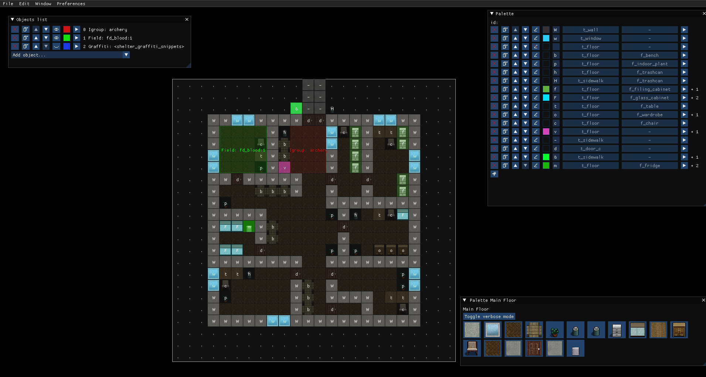

# Bright Nights Mapping Tool

Map making tool for [Cataclysm: Bright Nights](https://github.com/cataclysmbnteam/Cataclysm-BN).

## How to install
See [INSTALL.md](doc/BNMT/INSTALL.md)

## How to compile
See [COMPILING.md](doc/BNMT/COMPILING.md)

## How to use
See [TUTORIAL.md](doc/BNMT/TUTORIAL.md)

## Bugs and limitations
See [TODO.md](doc/BNMT/TODO.md) for list of planned features.

See [BUGS.md](doc/BNMT/BUGS.md) for list of known bugs.

If you don't see your issue there, please open a ticket or contact me on Discord.

## Feedback
I'm available on official Bright Nights Discord server: https://discord.gg/XW7XhXuZ89 , user id `olanti_p`.

## License
BNMT is licensed under the Creative Commons Attribution-ShareAlike 3.0 Unported License.
